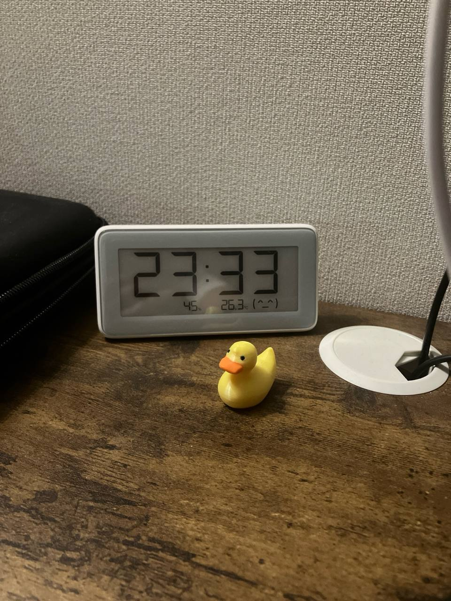

# YC S25 Companies Tracker & Scraper

This project is a lightweight scraper and minimalistic dashboard for tracking companies from the [Y Combinator Summer 2025 batch](https://www.ycombinator.com/companies?batch=Summer%202025).

I used 3 evenings to tackle this problem and it took me around 8 quite naive iterations and 2 serious conversations with a yellow duck on my desk:


## 📦 Features

- ✅ Scrapes latest companies from the YC S25 directory
- 🌐 Extracts:
  - Company Name
  - Full Description
  - Website
  - YC Company Page
  - LinkedIn Profile URL
  - Mentions of “YC S25” on LinkedIn
- 📊 Streamlit dashboard with interactive tables and charts
- 🕒 Automatically checks for new companies
- 🧠 Skips already-scraped companies to minimize runtime
- 💾 Data persistence via CSV

## 🖥️ Technologies

- Python 3.8+
- [Selenium](https://www.selenium.dev/)
- [BeautifulSoup](https://www.crummy.com/software/BeautifulSoup/)
- [Streamlit](https://streamlit.io/)
- [Plotly](https://plotly.com/python/)
- Pandas

## 📁 Dataset Columns

- `Company Name`: Name of the YC company
- `Full Description`: Description from the YC profile
- `YC Page`: Link to YC page
- `Website`: Company website
- `LinkedIn URL`: Link to LinkedIn company page (if found)
- `Mentions YC S25`: `1` if “YC S25” mentioned on LinkedIn, otherwise `0`

## 🚀 Running the App

1. **Clone the repo:**
   ```bash
   git clone https://github.com/yourusername/yc-s25-tracker.git
   cd yc-s25-tracker
2. **Install dependencies**
   ```bash
   pip install -r requirements.txt
2. **Launch the Streamlit App**
   ```bash
   streamlit run app.py

## File Structure:
   ```bash
   📦 yc-s25-tracker/
   │
   ├── app.py                     # Streamlit dashboard
   ├── scraper_utils.py          # Scraping logic (modular)
   ├── clean_new_data.csv        # Main dataset file
   ├── requirements.txt          # Python dependencies
   └── README.md                 # This file


   

